#  Week 3
## Exercise 1

    # Question 1
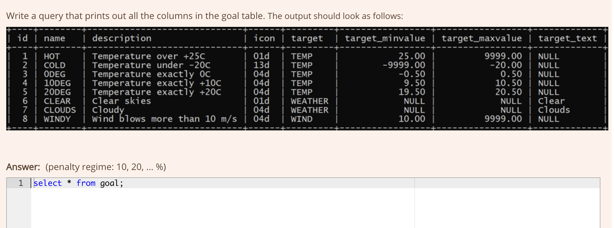

    # Question 2

    # Question 3
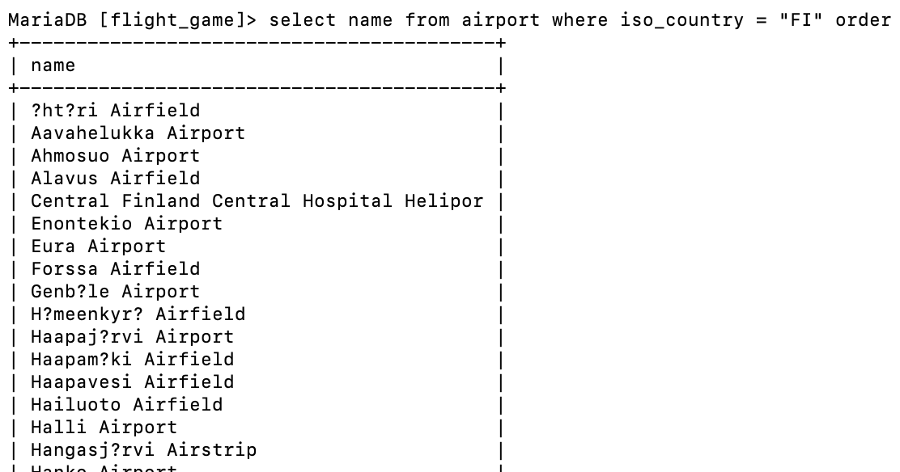

    # Question 4
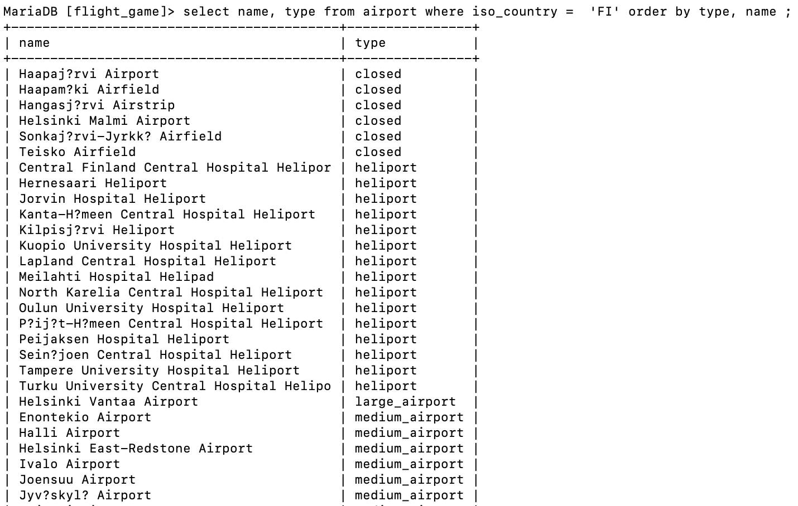

    # Question 5
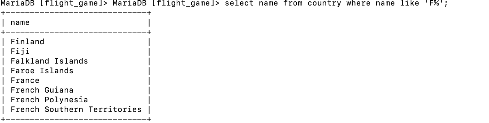

    # Question 6
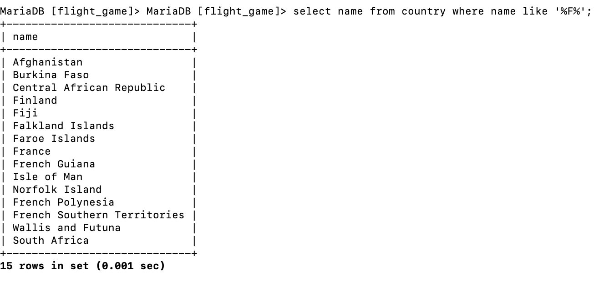

    # Question 7
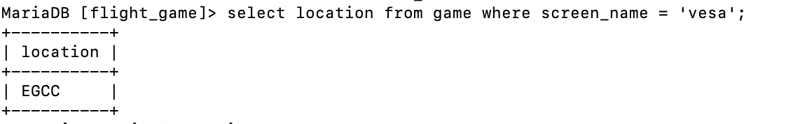

    # Question 8
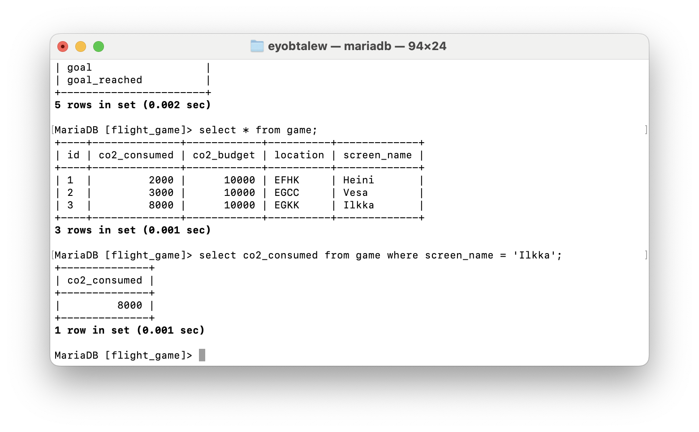

    # Question 9
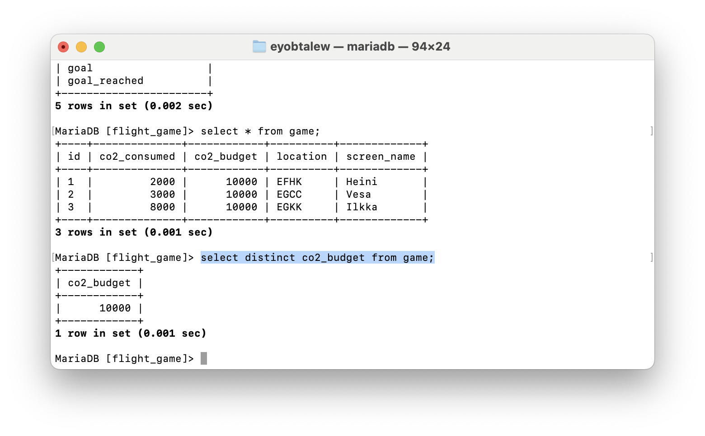
    
    # Question 10
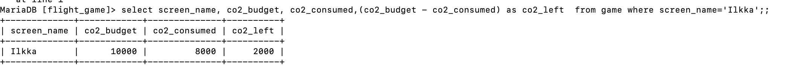

#  Week 3
## Exercise 3

    # Question 1
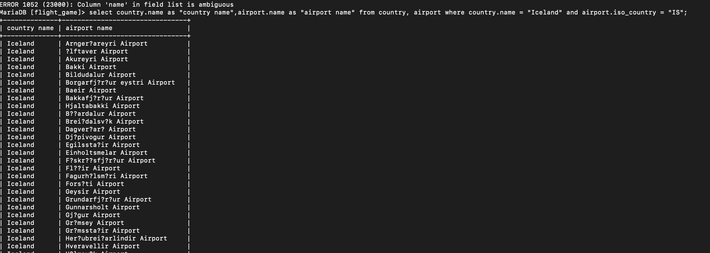

    # Question 2
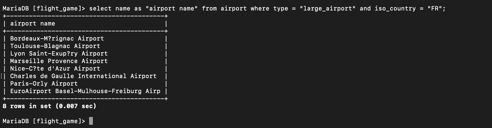

    # Question 3
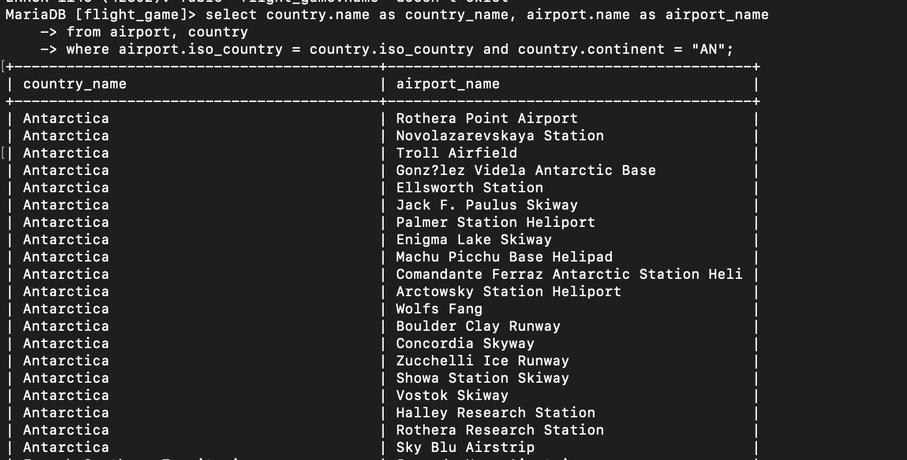

    # Question 4
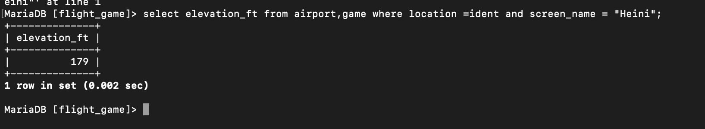

    # Question 5
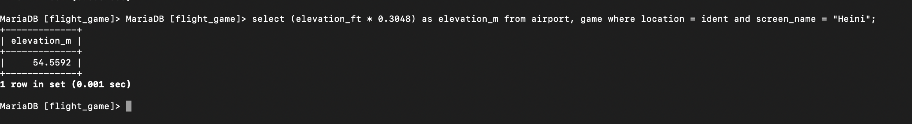

    # Question 6
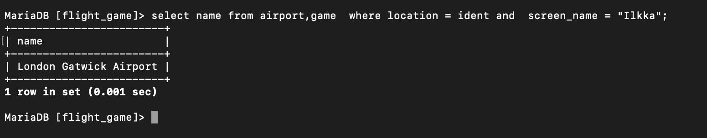

    # Question 7
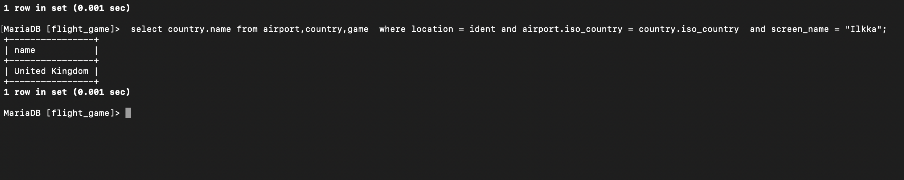

    # Question 8
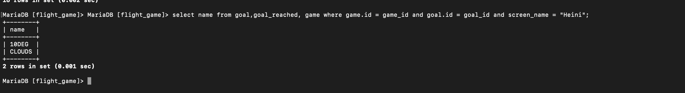

    # Question 9
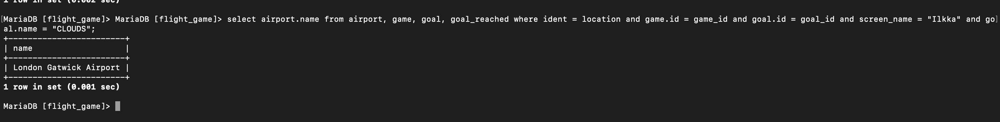

    # Question 10
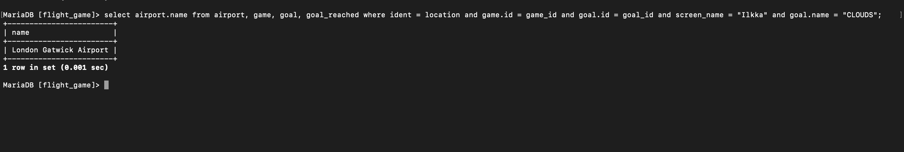

# Week 4
## Exercise 4

    # Question 1

    # Question 2
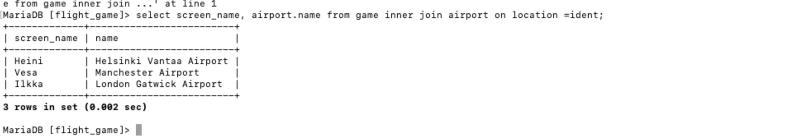

    # Question 3
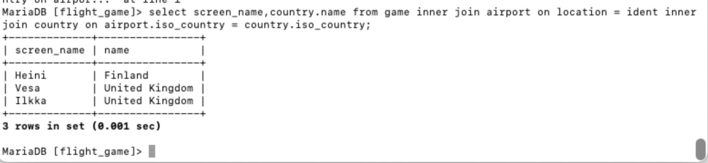

    # Question 4
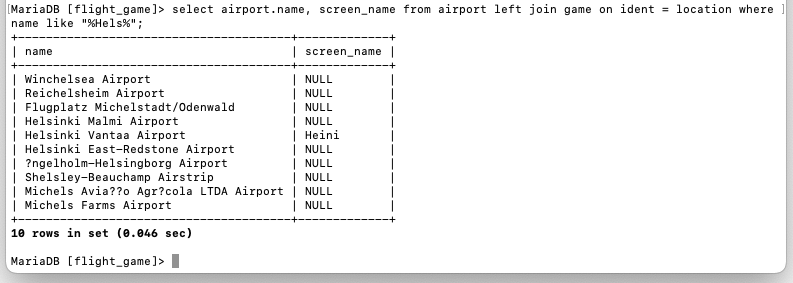

    # Question 5
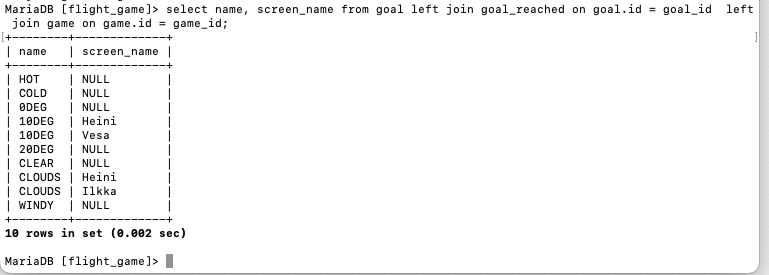

# Week 4
## Exercise 5
    
    # Question 1
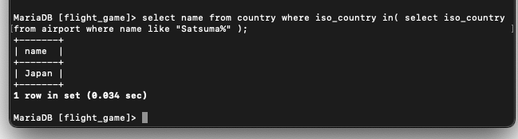

    # Question 2
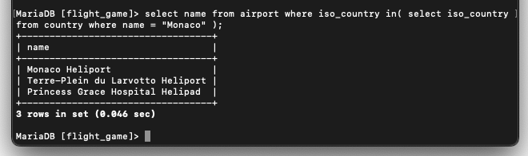

    # Question 3
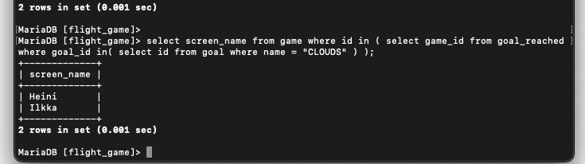

    # Question 4
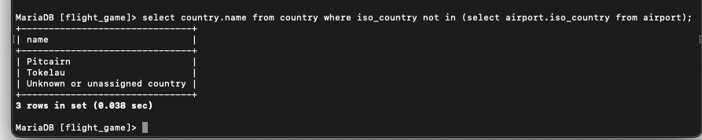

    # Question 5
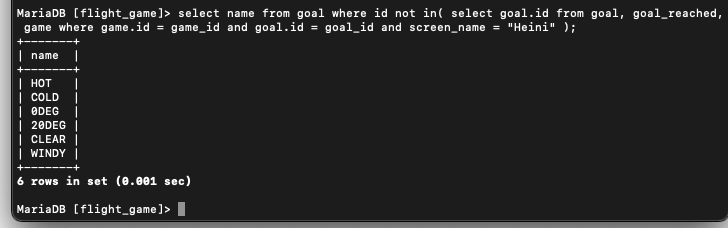

# Week 5
## Exercise 6

    # Question 1
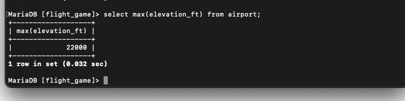

    # Question 2
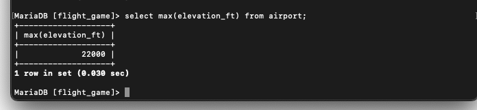

    # Question 3
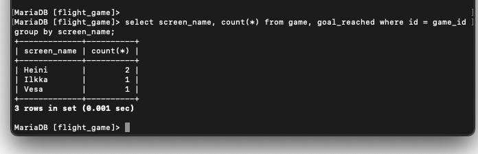

    # Question 4
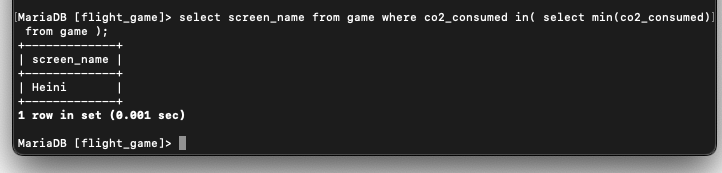

    # Question 5
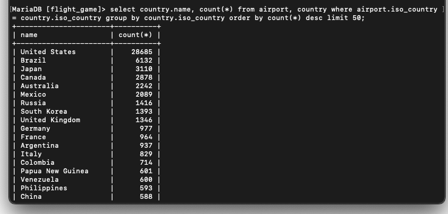

    # Question 6
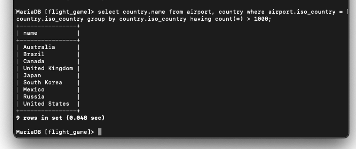

    # Question 7
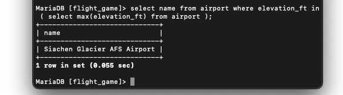

    # Question 8
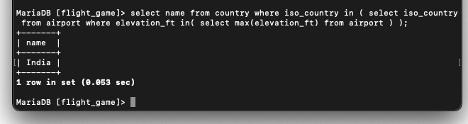

    # Question 9
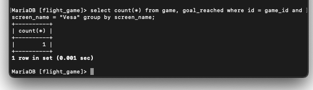

    # Question 10
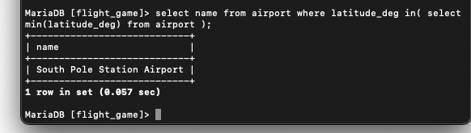
    

# Week 5
## Exercise 7

    # Question 1
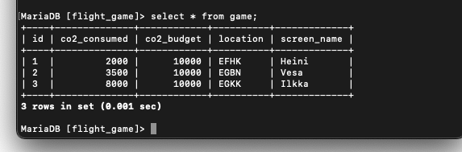

    # Question 2

    # Question 3
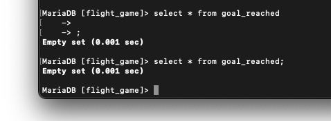

    # Question 4
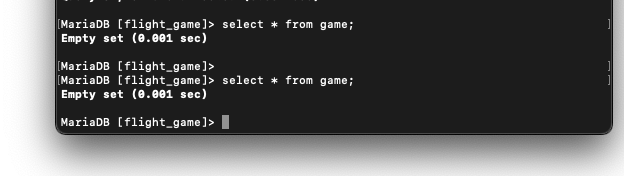

