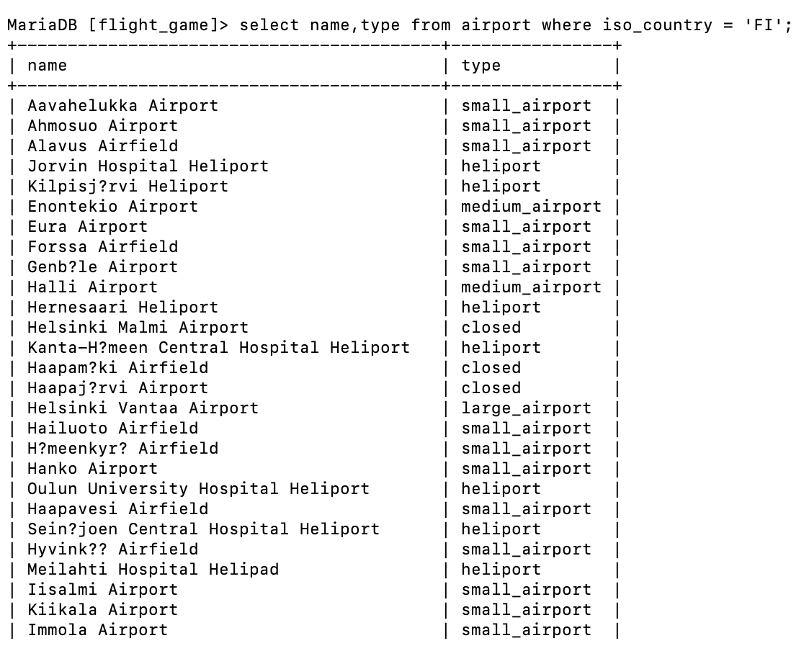
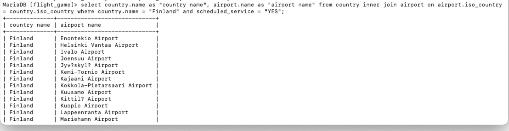

#  Week 3
## Exercise 1

    # Question 1

    # Question 2

    # Question 3

    # Question 4

    # Question 5

    # Question 6

    # Question 7

    # Question 8

    # Question 9

    
    # Question 10

#  Week 3
## Exercise 3

    # Question 1

    # Question 2

    # Question 3

    # Question 4

    # Question 5

    # Question 6

    # Question 7

    # Question 8

    # Question 9

    # Question 10

# Week 4
## Exercise 4

    # Question 1

    # Question 2

    # Question 3

    # Question 4

    # Question 5

# Week 4
## Exercise 5
    
    # Question 1

    # Question 2

    # Question 3

    # Question 4

    # Question 5

# Week 5
## Exercise 6

    # Question 1

    # Question 2

    # Question 3

    # Question 4

    # Question 5

    # Question 6

    # Question 7

    # Question 8

    # Question 9

    # Question 10

    

# Week 5
## Exercise 7

    # Question 1

    # Question 2

    # Question 3

    # Question 4

